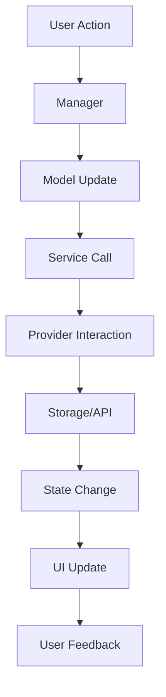

# 🏗️ Architecture Guide

This document provides detailed technical insights into the Waifu AI extension's architecture, design patterns, and implementation decisions.

## 🎯 Design Philosophy

### Clean Architecture Principles

The extension is built following **Clean Architecture** and **SOLID principles** to ensure maintainability, testability, and extensibility:

```
📊 Presentation Layer (UI)
    ↓ depends on
🔧 Application Layer (Coordination)
    ↓ depends on
💼 Domain Layer (Business Logic)
    ↓ depends on
🔌 Infrastructure Layer (External APIs)
```

### Dependency Flow

- **High-level modules** don't depend on low-level modules
- **Abstractions** (interfaces) define contracts
- **Concrete implementations** are injected as dependencies
- **Business logic** is isolated from external concerns

## 📁 Modular Structure

### Layer Breakdown

#### 🎨 **Presentation Layer**
```
sidebar.html        # Semantic HTML structure
sidebar.css         # Styling, animations, responsive design
UIManager.js        # View management and transitions
TooltipManager.js   # UI tooltip rendering
```

#### 🤝 **Application Layer (Coordinators)**
```
WaifuApp.js         # Main application coordinator
main.js             # Bootstrap with dependency injection
PomodoroManager.js  # Timer coordination
SettingsManager.js  # Settings coordination
```

#### 💼 **Domain Layer (Business Logic)**
```
models/
├── Todo.js         # Todo entity with validation
├── AffectionLevel.js # Affection calculation rules
└── PomodoroTimer.js  # Timer state management

services/
├── QuoteService.js      # Quote selection logic
├── AnimationService.js  # Animation utilities
└── DataValidationService.js # Validation rules
```

#### 🔌 **Infrastructure Layer**
```
interfaces/
├── IStorageProvider.js  # Storage abstraction
└── ILogger.js          # Logging abstraction

providers/
├── ChromeStorageProvider.js # Chrome API implementation
└── ConsoleLogger.js        # Console logging
```

## 🔄 Data Flow Architecture

### 1. **User Interaction Flow**
```
User Input → UIManager → WaifuApp → Manager → Model → Service → Provider
```

### 2. **Settings Management Flow**
```
Settings Panel → SettingsManager → Validation → Storage → Broadcast → UI Update
```

### 3. **Timer Integration Flow**
```
Timer Events → PomodoroManager → Quote Trigger → Character Mood → UI Feedback
```

## 🎯 SOLID Principles Implementation

### **Single Responsibility Principle (SRP)**

Each class has one clear responsibility:

```javascript
// ✅ Good: Single responsibility
class TodoManager {
  // Only handles todo CRUD operations
  add(text) { /* */ }
  toggle(index) { /* */ }
  delete(index) { /* */ }
}

class QuoteService {
  // Only handles quote selection logic
  getRandomQuote(mood) { /* */ }
  getQuoteByEvent(event) { /* */ }
}
```

### **Open/Closed Principle (OCP)**

Classes are open for extension, closed for modification:

```javascript
// ✅ Good: Extensible without modification
class AnimationService {
  static fadeIn(element) { /* base animation */ }
  
  // Can add new animations without changing existing code
  static slideIn(element) { /* new animation */ }
  static bounce(element) { /* new animation */ }
}
```

### **Liskov Substitution Principle (LSP)**

Implementations can be substituted without breaking functionality:

```javascript
// ✅ Good: Interface defines contract
class MockStorageProvider implements IStorageProvider {
  async get(key) { return mockData[key]; }
  async set(key, value) { mockData[key] = value; }
}

// Can substitute ChromeStorageProvider with MockStorageProvider
const app = new WaifuApp(new MockStorageProvider(), logger);
```

### **Interface Segregation Principle (ISP)**

Small, focused interfaces:

```javascript
// ✅ Good: Focused interfaces
interface IStorageProvider {
  get(key): Promise<any>
  set(key, value): Promise<void>
}

interface ILogger {
  log(message): void
  error(message): void
}
```

### **Dependency Inversion Principle (DIP)**

High-level modules depend on abstractions:

```javascript
// ✅ Good: Depends on abstraction
class WaifuApp {
  constructor(storageProvider: IStorageProvider, logger: ILogger) {
    // Depends on interfaces, not concrete classes
    this.storage = storageProvider;
    this.logger = logger;
  }
}
```

## 🔧 Key Design Patterns

### 1. **Manager Pattern**

Each major feature is controlled by a dedicated manager:

```javascript
class PomodoroManager {
  constructor(timer, ui, settings) {
    this.timer = timer;        // Domain model
    this.ui = ui;             // UI abstraction
    this.settings = settings; // Configuration
  }
  
  start() {
    // Coordinate between model, UI, and settings
  }
}
```

### 2. **Service Layer Pattern**

Cross-cutting concerns are handled by services:

```javascript
class QuoteService {
  // Encapsulates quote selection algorithm
  getRandomQuote(mood) {
    const quotes = this.getQuotesByMood(mood);
    return quotes[Math.floor(Math.random() * quotes.length)];
  }
}
```

### 3. **Provider Pattern**

External APIs are abstracted through providers:

```javascript
class ChromeStorageProvider implements IStorageProvider {
  async get(key) {
    return new Promise(resolve => {
      chrome.storage.local.get([key], result => {
        resolve(result[key]);
      });
    });
  }
}
```

### 4. **Observer Pattern**

Settings changes trigger updates across the system:

```javascript
class SettingsManager {
  applySettings(newSettings) {
    this.validateSettings(newSettings);
    this.saveSettings(newSettings);
    
    // Notify all managers of settings change
    this.notifyObservers('settingsChanged', newSettings);
  }
}
```

## 🔄 State Management

### Application State Flow



### Key State Containers

1. **Settings State**: Managed by `SettingsManager`
2. **Todo State**: Managed by `TodoManager`
3. **Timer State**: Managed by `PomodoroManager`
4. **Affection State**: Managed by `AffectionManager`
5. **UI State**: Managed by `UIManager`

## 🔀 Extension Points

### Adding New Features

The modular architecture makes it easy to add new features:

```javascript
// 1. Create a new model
class Habit {
  constructor(name, frequency) {
    this.name = name;
    this.frequency = frequency;
  }
}

// 2. Create a new manager
class HabitManager {
  constructor(storage, logger) {
    this.storage = storage;
    this.logger = logger;
  }
}

// 3. Integrate with main app
class WaifuApp {
  constructor(storage, logger) {
    // Add to existing managers
    this.habitManager = new HabitManager(storage, logger);
  }
}
```

### Adding New Storage Backends

```javascript
// Implement the IStorageProvider interface
class FirebaseStorageProvider implements IStorageProvider {
  async get(key) {
    return await firebase.database().ref(key).once('value');
  }
  
  async set(key, value) {
    await firebase.database().ref(key).set(value);
  }
}

// Inject into application
const app = new WaifuApp(new FirebaseStorageProvider(), logger);
```

## 🎭 Animation Architecture

### Animation Service Pattern

```javascript
class AnimationService {
  // Centralized animation utilities
  static fadeIn(element, duration = 300) { /* */ }
  static slideUp(element, duration = 300) { /* */ }
  static bounce(element, intensity = 1) { /* */ }
  
  // Complex coordinated animations
  static affectionBoost(container) {
    // Combines multiple animation primitives
    this.sparkle(container);
    this.shake(container);
    this.colorPulse(container);
  }
}
```

### CSS Animation Integration

```css
/* CSS animations triggered by JavaScript classes */
.floating-tooltip {
  animation: tooltipFloat 3s ease-in-out infinite;
}

@keyframes tooltipFloat {
  0%, 100% { transform: translateY(0px); }
  50% { transform: translateY(-5px); }
}
```

## 📊 Performance Considerations

### Memory Management

1. **Event Listener Cleanup**: Managers properly remove event listeners
2. **Timer Cleanup**: Intervals and timeouts are cleared on shutdown
3. **DOM Reference Management**: Avoid memory leaks with proper cleanup

### Optimization Strategies

1. **Debounced Settings**: Settings validation is debounced to prevent excessive calls
2. **Lazy Loading**: Managers are initialized only when needed
3. **Efficient DOM Updates**: Batch DOM modifications to minimize reflows

### Chrome Extension Constraints

1. **Storage Limits**: Handle Chrome storage quota efficiently
2. **Background Script Lifecycle**: Proper service worker management
3. **Content Security Policy**: No inline scripts, proper resource loading

## 🔒 Security Architecture

### Input Validation

```javascript
class DataValidationService {
  static validateTodoText(text) {
    if (!text || typeof text !== 'string') return false;
    if (text.length > 500) return false;
    if (text.includes('<script>')) return false;
    return true;
  }
}
```

### XSS Prevention

```javascript
function escapeHtml(text) {
  const div = document.createElement('div');
  div.textContent = text;
  return div.innerHTML;
}
```

## 🧪 Testing Architecture

### Unit Testing Strategy

```javascript
// Example test structure
describe('QuoteService', () => {
  let quoteService;
  
  beforeEach(() => {
    quoteService = new QuoteService(mockLogger);
  });
  
  it('should return appropriate quote for mood', () => {
    const quote = quoteService.getRandomQuote('happy');
    expect(quote).toMatch(/happy|joy|wonderful/i);
  });
});
```

### Integration Testing

```javascript
// Test manager coordination
describe('WaifuApp Integration', () => {
  it('should coordinate todo completion with affection increase', async () => {
    await app.todoManager.toggle(0);
    expect(app.affectionManager.level).toBeGreaterThan(initialLevel);
  });
});
```

---

This architecture enables:
- ✅ **Easy maintenance** through clear separation of concerns
- ✅ **Simple testing** with dependency injection
- ✅ **Feature extension** without breaking existing code
- ✅ **Performance optimization** through modular loading
- ✅ **Security** through proper validation and sanitization
